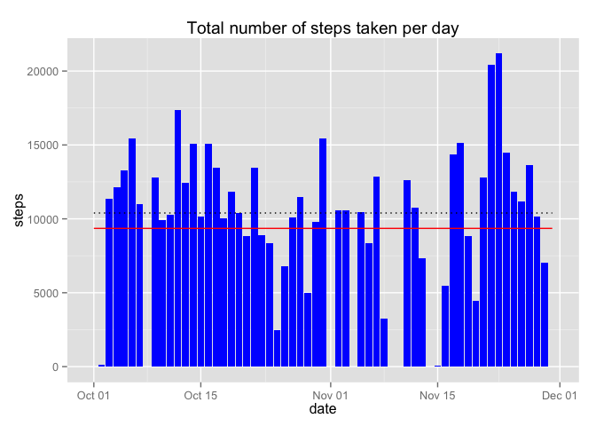
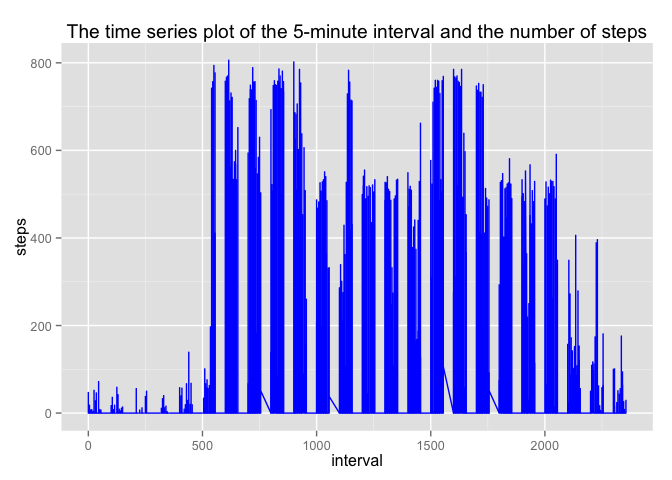
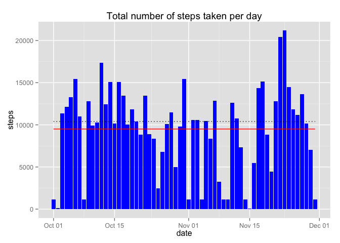
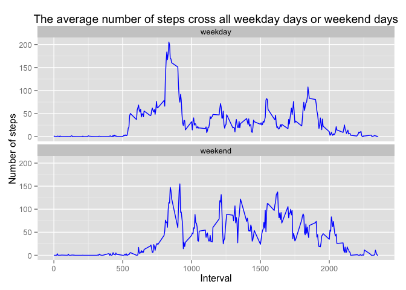

# Reproducible Research: Peer Assessment 1


## Loading and preprocessing the data

Firsr of all, unzip file with data.

```r
unzip("./activity.zip")
```
Then load data from file and convert field  'date' to Date type.

```r
activityData<-read.csv('./activity.csv', header = TRUE)
activityData$date<-as.Date(activityData$date)
```

## What is mean total number of steps taken per day?
Evaluate the total number of steps taken each day and save one to data frame.

```r
stepsPerDay<-as.data.frame.table(tapply(activityData$steps, activityData$date, FUN = sum, na.rm=TRUE))
names(stepsPerDay)<-c('date', 'steps')
stepsPerDay$date<-as.Date(stepsPerDay$date)
```

1. Make a histogram of the total number of steps taken each day.

```r
library(ggplot2)
Sys.setlocale("LC_TIME","en_GB.UTF-8")
```

```
## [1] "en_GB.UTF-8"
```

```r
qFig<-ggplot(data=stepsPerDay, aes(x=date, y=steps))
qFig + geom_bar(stat='identity', fill='blue')+ggtitle('Total number of steps taken per day')+ geom_line(stat="hline", aes(yintercept=mean((stepsPerDay$steps))), color='red')+geom_line(stat="hline", aes(yintercept=median(stepsPerDay$steps)), color='black', linetype='dotted')
```

 

2. Calculate the mean and median total number of steps taken per day.

```r
meanStep<-mean(stepsPerDay$steps)
medianSteps<-median(stepsPerDay$steps)
```
The mean total number of steps taken per day is 9354.2295 and median is 10395.

## What is the average daily activity pattern?

Clean data from 'NA'.

```r
cleanActivity<-activityData[!is.na(activityData$steps),]
```

1. Make a time series plot (i.e. type = "l") of the 5-minute interval (x-axis) and the average number of steps taken, averaged across all days (y-axis).

```r
library(ggplot2)
ggplot(cleanActivity,aes(x=interval, y=steps))+geom_line(color='blue')+ggtitle('The time series plot of the 5-minute interval and the number of steps')
```

 

2. Find 5-minute interval which contains the maximum number of steps.

```r
maxIterval<-cleanActivity$interval[which.max(cleanActivity$steps)]
```
The 5-minute intervals with maximum numbers of steps is 615.

## Imputing missing values

1. Calculate the total number of missing values in the dataset.

```r
sapply(activityData, function(x) sum(is.na(x)))
```

```
##    steps     date interval 
##     2304        0        0
```
2. Define a strategy for filling in all of the missing values in the dataset.  
   We will use the median numbers of steps for that  5-minute interval.

```r
medianStepsPerInt<-as.data.frame.table(tapply(activityData$steps, activityData$interval, median, na.rm=TRUE))
names(medianStepsPerInt)<-c('interval', 'steps')
```
3. Create a new dataset that is equal to the original dataset but with the missing data filled in.

```r
newActivity<-activityData
for (i in which(is.na(newActivity$steps))){
  newActivity$steps[i]=medianStepsPerInt$steps[medianStepsPerInt$interval==newActivity$interval[i]]
}
```
4. Make a histogram of the total number of steps taken each day .

```r
library(ggplot2)
newStepsPerDay<-as.data.frame.table(tapply(newActivity$steps, newActivity$date, FUN = sum))
names(newStepsPerDay)<-c('date', 'steps')
newStepsPerDay$date<-as.Date(newStepsPerDay$date)
ggplot(newStepsPerDay, aes(x=date, y=steps)) + ggtitle('Total number of steps taken per day') + geom_bar(stat='identity', fill='blue')+geom_line(stat="hline", aes(yintercept=mean((newStepsPerDay$steps))), color='red')+geom_line(stat="hline", aes(yintercept=median(newStepsPerDay$steps)), color='black', linetype='dotted')
```

 

Calculate and report the mean and median total number of steps taken per day

```r
meanStep<-mean(stepsPerDay$steps)
medianSteps<-median(stepsPerDay$steps)
newMeanStep<-mean(newStepsPerDay$steps)
newMedianSteps<-median(newStepsPerDay$steps)
stepsFeat<-matrix(c(meanStep, medianSteps, newMeanStep, newMedianSteps, newMeanStep- meanStep, newMedianSteps-medianSteps), ncol = 3, nrow=2)
colnames(stepsFeat)<-c('Old Value', 'New Value', 'Diff')
rownames(stepsFeat)<-c('Mean', 'Median')
stepsFeat
```

```
##        Old Value New Value  Diff
## Mean        9354      9504 149.6
## Median     10395     10395   0.0
```

## Are there differences in activity patterns between weekdays and weekends?
1. Create a new factor variable in the dataset with two levels -- "weekday" and "weekend" indicating whether a given date is a weekday or weekend day.

```r
library(timeDate)
newActivity<-cbind(dayType = 0, newActivity)
for(i in 1:nrow(newActivity)){
  if(isWeekday(newActivity$date[i])){
    newActivity$dayType[i]<-'weekday'}
  else{
    newActivity$dayType[i]<-'weekend'
  }
}
```
2. Make a panel plot containing a time series plot of the 5-minute interval (x-axis) and the average number of steps taken, averaged across all weekday days or weekend days (y-axis). 

```r
library(plyr)
library(ggplot2)
stepsPerDayType<-ddply(newActivity, .(interval, dayType), summarize, meanSteps=mean(steps))
ggplot(stepsPerDayType, aes(x=interval,y=meanSteps))+geom_line(color='blue')+facet_wrap(~dayType, nrow=2) +ylab('Number of steps')+xlab('Interval')+ggtitle('The average number of steps cross all weekday days or weekend days')
```

 
